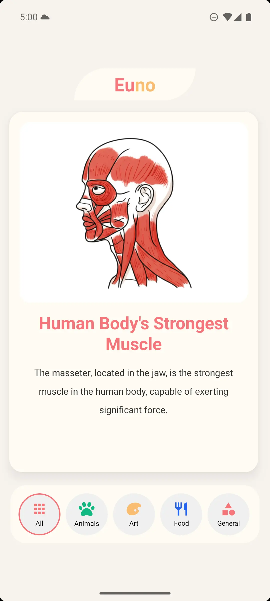

# Euno

> AI-powered React Native app that lets you browse and swipe through simple, interesting facts.

## Demo

<table style="width: 50%; border-collapse: collapse;  border: 1px solid #ddd;">

  <thead>
    <tr>
      <th style="border: 1px solid #ddd; text-align: center; padding: 8px;">Dark Theme</th>
      <th style="border: 1px solid #ddd; text-align: center; padding: 8px;">Light Theme</th>
      <th style="border: 1px solid #ddd; text-align: center; padding: 8px;">Demo Animation</th>
    </tr>
  </thead>

  <tbody>
    <tr>
      <td style="border: 1px solid #ddd">
        
      </td>
      <td style="border: 1px solid #ddd">
        
      </td>
      <td style="border: 1px solid #ddd">
        
      </td>
    </tr>
  </tbody>
</table>

## Overview

Euno showcases bite-sized educational facts generated using AI.  
Facts are automatically created via **Convex cron jobs** and the **Google Gemini API**, and may include simple illustrations.

**Key Features:**

- Browse AI-generated facts by category
- Swipe through scrollable fact cards
- Supports both light and dark themes
- Facts are updated automatically via background cron jobs
- Images are simple, visually balanced, and contain no text or logos

## How It Works

1. **Fact Generation:** Convex cron jobs periodically trigger AI to generate facts in JSON format.
2. **Image Generation:** Facts marked as `imageNeeded` receive small illustrations stored in Convex.
3. **Frontend:** React Native + Expo renders the app and the scrollable fact cards.

## Tech Stack

- **Frontend:** React Native + Expo
- **Backend & Storage:** Convex (cron jobs, database, storage)
- **AI Integration:** Google Gemini API
- **Styling:** Tailwind CSS with light/dark themes
